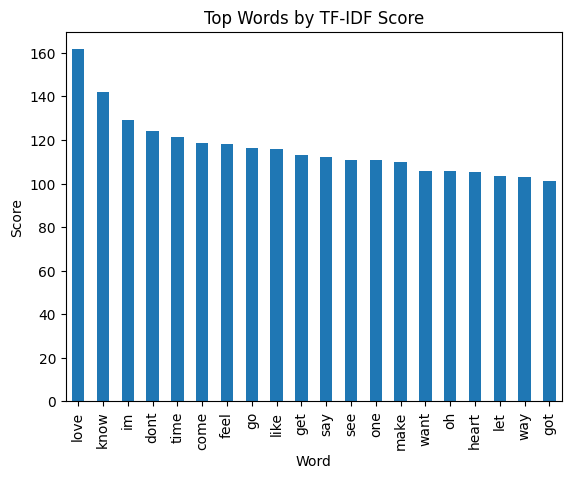
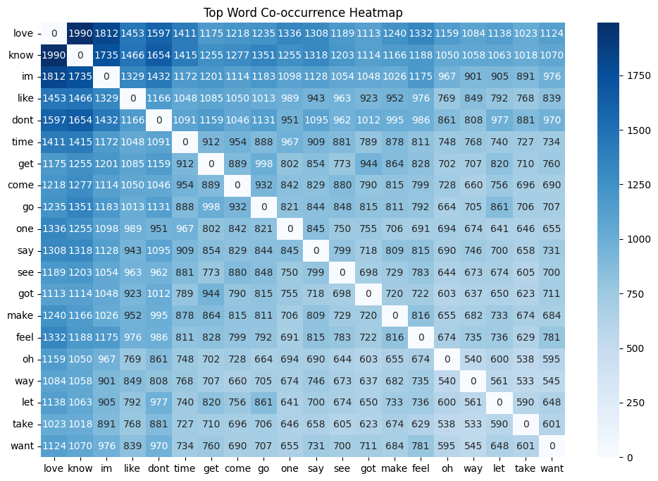

# Classifying Music Genres Through Lyrics: A Machine Learning Approach

## Overview
**Classifying Music Genres Through Lyrics: A Machine Learning Approachs** is a machine learning project developed  to classify music genres based on song lyrics. Using **Natural Language Processing (NLP)** techniques and models like **KNN**, **Naive Bayes**, **CNN**, **LSTM**, **RNN**, and a novel **CNN-LSTM ensemble**, the project analyzes lyrical content to predict genres such as Pop, Rock, Country, and Folk. It leverages embeddings like **GloVe**, **Word2Vec**, and **BERT**, achieving up to **63% accuracy** with the CNN model. The project includes visualizations to explore lyrical patterns and contributes to music information retrieval by highlighting the power of lyrical analysis.


## Features
- **Text Preprocessing**:
  - Lowercasing, punctuation removal, tokenization, stop word removal, and stemming using **NLTK** and **SnowballStemmer**.
- **Feature Extraction**:
  - **Count Vectorizer**: Generates sparse word frequency matrices.
  - **GloVe**: Combines `glove-wiki-gigaword-100` and `glove-twitter-200` embeddings.
  - **Word2Vec**: Uses `word2vec-googlenews-300` for word embeddings.
  - **BERT**: Employs `all-MiniLM-L6-v2` with **SMOTE** for class balancing.
- **Models**:
  - Traditional: **KNN**, **Bernoulli Naive Bayes (BNB)**, **Multinomial Naive Bayes (MNB)**.
  - Deep Learning: **CNN**, **LSTM**, **RNN**, and a **CNN-LSTM ensemble** for capturing local and sequential patterns.
- **Visualizations**:
  - **Figure 1: Genre Distribution**: Bar chart showing song frequency across genres (Pop, Rock, Country, Folk).
    
  - **Figure 3: TF-IDF Word Score**: Multi-panel bar charts of top 10 terms per genre, highlighting genre-specific lexical patterns.
    
  - **Figure 4: Top Word Co-occurrence Heat Map**: Visualizes word co-occurrence frequencies, revealing semantic networks and genre-specific lyrical patterns.
    

## Results
- **Best Model**: The **CNN** model achieved the highest accuracy at **63%**, followed by **LSTM** at **60.8%** and the **CNN-LSTM ensemble** at **60%**.
- **Feature Extraction Performance**:
  - **BERT**: 56.5% accuracy with **LightGBM**.
  - **Count Vectorizer**: 51.92% accuracy.
  - **GloVe**: 50.84% accuracy.
  - **Word2Vec**: 49.87% accuracy.
- **Key Insights**:
  - Country music was easiest to classify (F1: 0.70 for CNN) due to distinct themes like trucks and heartbreak.
  - Genres like Jazz and Folk were challenging due to class imbalance (F1: 0.17 and 0.08, respectively).
  - Misclassifications occurred in crossover songs (e.g., Country-Pop) due to shared terms like "love" and "baby".

## Installation and Setup
1. **Clone the Repository**:
   ```bash
   git clone https://github.com/shruthic06/Music-Genre-Classification-Through-Lyrics.git
   ```
2. **Navigate to the Project Directory**:
   ```bash
   cd Music-Genre-Classification-Through-Lyrics
   ```
3. **Set Up a Virtual Environment** (recommended):
   ```bash
   python -m venv venv
   source venv/bin/activate  # On Windows: venv\Scripts\activate
   ```
4. **Install Dependencies**:
   - Ensure **Python 3.8+** is installed.
   - Install required packages listed in `requirements.txt`:
     ```bash
     cd code
     pip install -r requirements.txt
     ```
5. **Download NLTK Data**:
   - Download NLTK resources for preprocessing:
     ```bash
     python -m nltk.downloader stopwords snowball_data
     ```
6. **Download Pre-trained Models**:
   - Download GloVe embeddings (`glove-wiki-gigaword-100`, `glove-twitter-200`) from [Stanford NLP](https://nlp.stanford.edu/projects/glove/).
   - Download Word2Vec (`word2vec-googlenews-300`) from [Google Code Archive](https://code.google.com/archive/p/word2vec/).
   - Place these in a `models/` directory or update paths in the scripts.
7. **Download the Dataset**:
   - Obtain the **Spotify Million Songs** dataset from [Kaggle](https://www.kaggle.com/datasets).
   - Place it in a `data/` directory or update the data path in the scripts.
8. **Extract Images from the Report**:
   - Open `Final Report.pdf` in a PDF viewer or editor (e.g., Adobe Acrobat, Preview, or online tools like Smallpdf).
   - Extract Figures 1, 3, 4, and 9 as PNG images using a screenshot tool or PDF export feature.
   - Save them as:
     - `figure-1-genre-distribution.png`
     - `figure-3-tfidf-scores.png`
     - `figure-4-word-cooccurrence-heatmap.png`
     - `figure-9-cnn-results.png`
   - Place them in the `images/` folder:
     ```bash
     mkdir images
     mv *.png images/
     git add images/*
     git commit -m "Add report figures for README"
     git push origin main
     ```

## Usage
- **Preprocessing**: Run the preprocessing pipeline to clean lyrics (lowercase, remove punctuation, tokenize, remove stop words, stem) and generate a `Pre_Processed_Text` column.
- **Feature Extraction**: Select **Count Vectorizer**, **GloVe**, **Word2Vec**, or **BERT** for transforming lyrics into numerical features.
- **Model Training**: Train models like **KNN**, **Naive Bayes**, **CNN**, **LSTM**, **RNN**, or **CNN-LSTM ensemble** using provided scripts.
- **Visualizations**: View extracted figures (e.g., genre distribution, TF-IDF scores, heatmap) to analyze lyrical patterns.
- **Evaluation**: Review model performance metrics (accuracy, F1-scores) for genres like Pop, Rock, and Country.

## Project Structure
- `main.py`: Main script for preprocessing, feature extraction, model training, and evaluation.
- `notebooks/`: Jupyter notebooks for exploratory data analysis and visualizations.
- `data/`: Directory for the Spotify Million Songs dataset.
- `models/`: Scripts for training **KNN**, **Naive Bayes**, **CNN**, **LSTM**, **RNN**, and **CNN-LSTM ensemble**.
- `images/`: Directory for visualization images (e.g., `figure-1-genre-distribution.png`, `figure-4-word-cooccurrence-heatmap.png`).
- `requirements.txt`: List of required Python packages.

## Future Improvements
- **Multimodal Integration**: Combine lyrics with audio features for enhanced accuracy.
- **Larger Datasets**: Use more diverse datasets to address class imbalance.
- **Advanced Models**: Experiment with transformer-based models like **DistilBERT** or **RoBERTa**.
- **Multi-Label Classification**: Support songs with multiple genres.
- **Real-Time Predictions**: Integrate with music streaming APIs for live genre classification.

## References
- Spotify Million Songs dataset: [Kaggle](https://www.kaggle.com/datasets)
- NLTK: [https://www.nltk.org/](https://www.nltk.org/)
- GloVe: [https://nlp.stanford.edu/projects/glove/](https://nlp.stanford.edu/projects/glove/)
- Word2Vec: [https://code.google.com/archive/p/word2vec/](https://code.google.com/archive/p/word2vec/)
- Transformers: [https://huggingface.co/](https://huggingface.co/)
- Research paper: [Classifying Music Genres Through Lyrics: A Machine Learning Approach](#)
